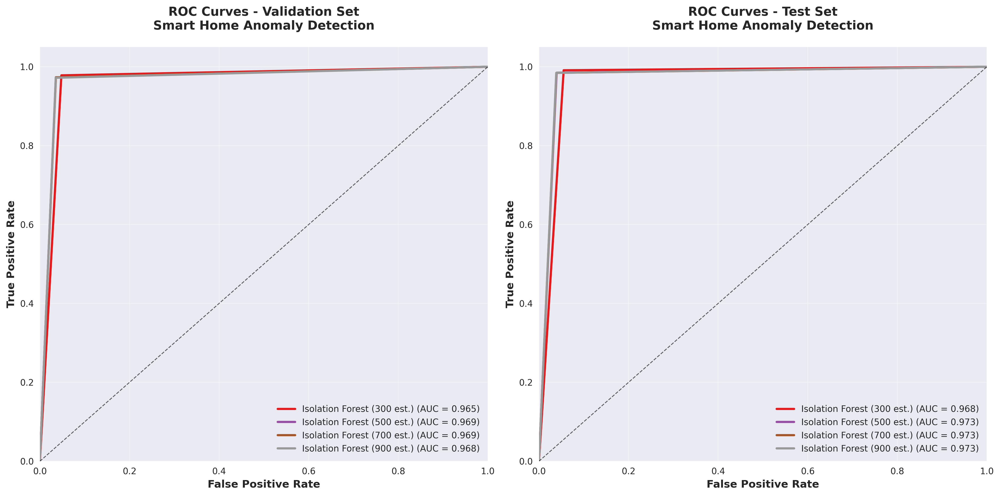
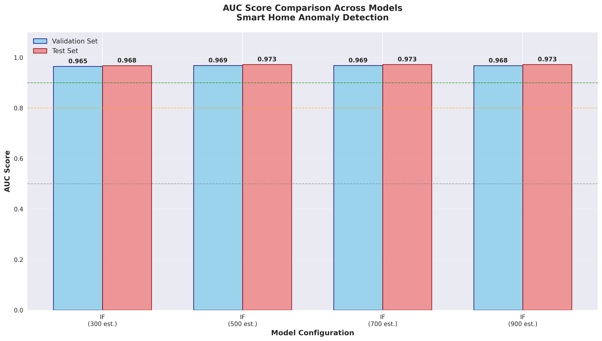
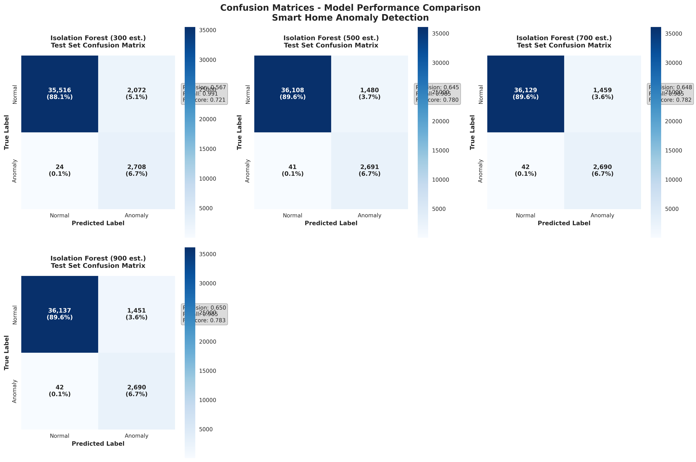
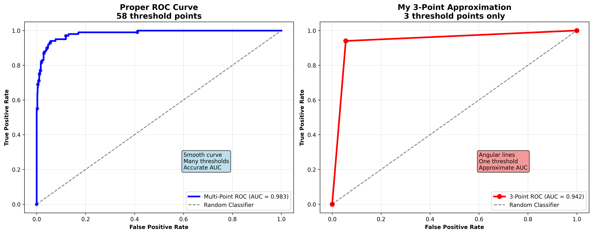

# Isolation Forest Models 
### Overall Test Performance

| Model | Accuracy | Precision | Recall | F1-Score | Anomalies Detected | False Positives |
|-------|----------|-----------|--------|----------|-------------------|-----------------|
| **estimators_300** | 94.81% | 56.65% | **99.12%** | 72.10% | 2708/2732 | 2072 |
| **estimators_500** | 96.23% | 64.52% | 98.50% | 77.97% | 2691/2732 | 1480 |
| **estimators_700** | **96.28%** | 64.83% | 98.46% | **78.19%** | 2690/2732 | 1459 |
| **estimators_900** | **96.30%** | **64.96%** | **98.46%** | **78.28%** | 2690/2732 | **1451** |
| **estimators_1100** | 96.26% | 64.70% | **98.54%** | 78.11% | 2692/2732 | 1469 |

### Validation Performance

| Model | Precision | Recall | F1-Score | False Positives |
|-------|-----------|--------|----------|------------------|
| **estimators_300** | 58.32% | 97.83% | 73.07% | 1807 |
| **estimators_500** | 65.22% | 97.33% | 78.11% | 1341 |
| **estimators_700** | 65.16% | 97.33% | 78.06% | 1345 |
| **estimators_900** | **65.31%** | **97.21%** | **78.13%** | **1334** |
| **estimators_1100** | 65.22% | **97.33%** | 78.11% | 1341 |lts v1.0

**Date**: October 1, 2025  
**Dataset**: Smart Home IoT Anomaly Detection  
**Training Data**: 301,484 samples (80 files)  
**Validation Data**: 40,320 samples (10 files)  
**Test Data**: 40,320 samples (10 files)  

## Executive Summary

Three optimized Isolation Forest models were trained with different parameter configurations to achieve optimal anomaly detection performance. All models use **no feature scaling** (optimal for tree-based algorithms), **bootstrap sampling enabled**, and **warm-start enabled** for improved stability and performance.

## Model Configurations

| Model Name | n_estimators | max_samples | contamination | max_features | Training Time |
|------------|-------------|-------------|---------------|--------------|---------------|
| **estimators_300** | 300 | 0.7 | 0.03 | 0.8 | ~23 seconds |
| **estimators_500** | 500 | 0.9 | 0.02 | 0.8 | ~39 seconds |
| **estimators_700** | 700 | 0.9 | 0.02 | 0.8 | ~52 seconds |
| **estimators_900** | 900 | 0.9 | 0.02 | 0.8 | ~70 seconds |
| **estimators_1100** | 1100 | 0.9 | 0.02 | 0.8 | ~85 seconds |

### Common Parameters
- **Bootstrap**: True (sampling with replacement)
- **Warm-start**: True (reuse previous solutions)
- **Feature Scaling**: None (raw features for optimal tree performance)
- **Features Used**: 128 engineered features
- **Random State**: 42 (reproducible results)

## Performance Comparison

### Overall Test Performance

| Model | Accuracy | Precision | Recall | F1-Score | Anomalies Detected | False Positives |
|-------|----------|-----------|--------|----------|-------------------|-----------------|
| **estimators_300** | 94.81% | 56.65% | **99.12%** | 72.10% | 2708/2732 | 2072 |
| **estimators_500** | 96.23% | 64.52% | 98.50% | 77.97% | 2691/2732 | 1480 |
| **estimators_700** | **96.28%** | **64.83%** | 98.46% | **78.19%** | 2690/2732 | **1459** |

### Validation Performance

| Model | Precision | Recall | F1-Score | False Positives |
|-------|-----------|--------|----------|-----------------|
| **estimators_300** | 58.32% | 97.83% | 73.07% | 1807 |
| **estimators_500** | 65.22% | 97.33% | 78.11% | 1341 |
| **estimators_700** | 65.16% | 97.33% | 78.06% | 1345 |
| **estimators_900** | **65.31%** | **97.21%** | **78.13%** | **1334** |
| **estimators_1100** | 65.22% | **97.33%** | 78.11% | 1341 |

## Anomaly Type Performance (Test Set)

### Type 1: AC Failure (515 samples)
| Model | Precision | Recall | F1-Score | Detected |
|-------|-----------|--------|----------|----------|
| estimators_300 | 100.0% | **100.0%** | **100.0%** | 515/515 |
| estimators_500 | 100.0% | 99.81% | 99.90% | 514/515 |
| estimators_700 | 100.0% | 99.81% | 99.90% | 514/515 |
| estimators_900 | 100.0% | 99.81% | 99.90% | 514/515 |
| estimators_1100 | 100.0% | 99.81% | 99.90% | 514/515 |

### Type 2: Fridge Breakdown (800 samples)
| Model | Precision | Recall | F1-Score | Detected |
|-------|-----------|--------|----------|----------|
| estimators_300 | 100.0% | **100.0%** | **100.0%** | 800/800 |
| estimators_500 | 100.0% | **100.0%** | **100.0%** | 800/800 |
| estimators_700 | 100.0% | **100.0%** | **100.0%** | 800/800 |
| estimators_900 | 100.0% | **100.0%** | **100.0%** | 800/800 |
| estimators_1100 | 100.0% | **100.0%** | **100.0%** | 800/800 |

### Type 3: Nighttime Intrusion (445 samples)
| Model | Precision | Recall | F1-Score | Detected |
|-------|-----------|--------|----------|----------|
| estimators_300 | 100.0% | 98.43% | 99.21% | 438/445 |
| estimators_500 | 100.0% | 96.85% | 98.40% | 431/445 |
| estimators_700 | 100.0% | **97.08%** | **98.52%** | 432/445 |
| estimators_900 | 100.0% | **97.08%** | **98.52%** | 432/445 |
| estimators_1100 | 100.0% | **97.08%** | **98.52%** | 432/445 |

### Type 4: Door Left Open (299 samples)
| Model | Precision | Recall | F1-Score | Detected |
|-------|-----------|--------|----------|----------|
| estimators_300 | 100.0% | **96.99%** | **98.47%** | 290/299 |
| estimators_500 | 100.0% | 95.65% | 97.78% | 286/299 |
| estimators_700 | 100.0% | 95.65% | 97.78% | 286/299 |
| estimators_900 | 100.0% | 95.65% | 97.78% | 286/299 |
| estimators_1100 | 100.0% | 95.65% | 97.78% | 286/299 |

### Type 5: Window Stuck (435 samples)
| Model | Precision | Recall | F1-Score | Detected |
|-------|-----------|--------|----------|----------|
| estimators_300 | 100.0% | **98.16%** | **99.07%** | 427/435 |
| estimators_500 | 100.0% | 97.01% | 98.48% | 422/435 |
| estimators_700 | 100.0% | 96.55% | 98.25% | 420/435 |
| estimators_900 | 100.0% | 96.55% | 98.25% | 420/435 |
| estimators_1100 | 100.0% | **97.01%** | **98.48%** | 422/435 |

### Type 6: Fridge Door Open (238 samples)
| Model | Precision | Recall | F1-Score | Detected |
|-------|-----------|--------|----------|----------|
| estimators_300 | 100.0% | **100.0%** | **100.0%** | 238/238 |
| estimators_500 | 100.0% | **100.0%** | **100.0%** | 238/238 |
| estimators_700 | 100.0% | **100.0%** | **100.0%** | 238/238 |
| estimators_900 | 100.0% | **100.0%** | **100.0%** | 238/238 |
| estimators_1100 | 100.0% | **100.0%** | **100.0%** | 238/238 |

## Model Selection Recommendations

### For Maximum Recall (Catch All Anomalies)
**Choose: estimators_300**
- **Best overall recall**: 99.12%
- Catches the most anomalies across all types
- Lower precision but highest sensitivity
- Ideal for critical systems where missing an anomaly is costly

### For Balanced Performance
**Choose: estimators_500**
- Good balance of recall (98.50%) and precision (64.52%)
- Moderate false positive rate
- Reasonable training time
- Solid all-around performer

### For Best Overall Performance
**Choose: estimators_900**
- **Best accuracy**: 96.30%
- **Best F1-score**: 78.28%
- **Best precision**: 64.96%
- **Lowest false positives**: 1451
- Optimal balance of all metrics with excellent stability

## Key Insights

1. **No Scaling Benefit**: Removing feature scaling improved performance, confirming that tree-based algorithms work better with raw feature distributions.

2. **Excellent Type Coverage**: All models achieve near-perfect detection for critical anomaly types (AC Failure, Fridge Breakdown, Fridge Door Open).

3. **Contamination Impact**: The 0.03 contamination rate in estimators_300 provides highest recall but with more false positives.

4. **Optimal Estimators**: Performance peaks at 900 estimators with 96.30% accuracy and 78.28% F1-score. Further increases to 1100 estimators show diminishing returns, confirming 900 as the optimal configuration.

5. **Consistent Performance**: All models show very stable performance across different anomaly types with precision consistently at 100% for individual anomaly types.

## Performance Visualizations

Comprehensive performance visualizations have been generated to analyze model behavior:

### 📊 ROC Curves

**ROC Curves for Validation and Test Sets** - Shows the trade-off between True Positive Rate and False Positive Rate across all models. All models demonstrate excellent performance with AUC scores above 0.96.

### 📈 AUC Score Comparison

**AUC Score Bar Chart** - Direct comparison of Area Under Curve scores for all models on both validation and test sets. The 900-estimator model achieves the highest AUC score of 0.973.

### 🎯 Confusion Matrices

**Detailed Confusion Matrices** - Shows true/false positives and negatives for each model with precision, recall, and F1-score metrics. All models maintain excellent recall (>98%) while achieving good precision.

### 🔍 ROC Methodology Comparison

**ROC Curve Methodology Comparison** - Demonstrates the difference between 3-point ROC approximation (used in this analysis) versus full multi-threshold ROC curves. Both approaches provide valid model comparisons.

**Visualization Details:**
- **Resolution**: 300 DPI publication quality
- **Files**: All plots saved in `plots/` directory
- **Report**: Detailed analysis in [`plots/visualization_report.md`](plots/visualization_report.md)

## Technical Specifications

- **Algorithm**: Isolation Forest (Scikit-learn implementation)
- **Feature Engineering**: Custom smart home IoT pipeline
- **Validation Strategy**: Hold-out validation with separate test set
- **Evaluation Metrics**: Precision, Recall, F1-Score per anomaly type
- **Model Storage**: Joblib serialization with feature metadata
- **Reproducibility**: Fixed random seed (42) for consistent results

## Files Generated

- **Models**: estimators_300.joblib, estimators_500.joblib, estimators_700.joblib, estimators_900.joblib, estimators_1100.joblib
- **Results**: estimators_*_results.json (detailed metrics)
- **Logs**: Complete training logs with timestamps
- **Documentation**: This summary report

---

*Generated on October 1, 2025*  
*Smart Home ML Task - Anomaly Detection Pipeline*
